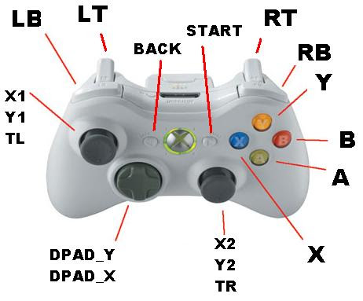

# xboxdrv

Setting up [xboxdrv](https://gitlab.com/xboxdrv/xboxdrv)

### Xbox controller layout

### Getting buttons names

Use `evtest`:

    evtest /dev/input/by-id/usb-GameSir_GameSir-T2a_3010-event-joystick

### GameSir T2a wired

    xboxdrv --evdev /dev/input/by-id/usb-GameSir_GameSir-T2a_3010-event-joystick \
      --evdev-absmap ABS_BRAKE=lt,ABS_GAS=rt,ABS_HAT0X=dpad_x,ABS_HAT0Y=dpad_y,ABS_X=x1,ABS_Y=y1,ABS_Z=x2,ABS_RZ=y2,\
      --evdev-keymap BTN_SOUTH=a,BTN_EAST=b,BTN_NORTH=x,BTN_WEST=y,BTN_TL=lb,BTN_TR=rb,BTN_SELECT=back,BTN_START=start,BTN_THUMBL=tl,BTN_THUMBR=tr \
      --axismap -y1=y1,-y2=y2 \
      --detach-kernel-driver --mimic-xpad --force-feedback --silent
